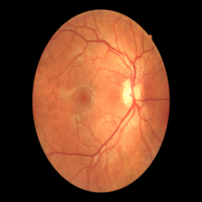
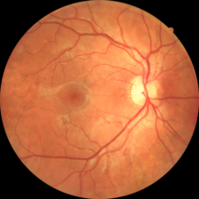
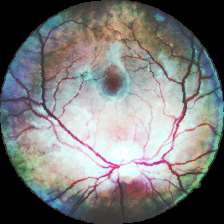

# Fundus Images
This repository provides the pipeline to reproduce the results from [In-Depth Exploration of Deep Aging Clocks in Ophthalmology Using the AEyeDB Dataset](TODO). 

## Data 
For the Analysis we used the [Papila](https://www.nature.com/articles/s41597-022-01388-1), [OIA-ODIR](https://link.springer.com/chapter/10.1007/978-3-030-71058-3_11) and [AEyeDB](TODO) datasets. In order to obtain the AEyeDB dataset, please submit a reasonable research request to the principal investigator [Professor Dr. Heider](https://heiderlab.de/).

## Preprocessing
The functions used for the preprocessing steps can be found in the Preproc.py file. During preprocessing, images were cropped, downsized, equalized, and rotated. 

  
  
  

